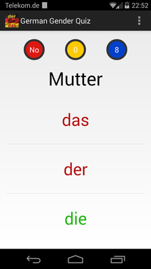

android-quiz-template
=====================

# Introduction

An android library project to use for different types of multiple-answer quiz applications. 
In particular the templates offers 2 kind of quizes, or game modes:
* Educational Game: for learning while playing through a clever repetition system of questions which has been answered wrongly.
* Trivia Game: for a more classic and fast hit or miss kind of game.

Moreover the library provides a quiz domain model and logic and a lot of extensible UI elements.

##Features
* Educational Game Template
* Trivia Game Template
* Multiple correct answer mode
* Pretty and Extensible UI
* Random order answers (the answers are always shown in a random position)
* Pretty user feedback and record managent 
* Question categorization
* Settings Activity for selecting which categories should be active for the current quiz
* Compatibility with AndroidAnnotations (http://androidannotations.org/)
* DefaultUncaughtExceptionHandler with bug report functionality

##Educational Game



* Educational Game: In an educational game the user really has to focus and try to memorize the correct answers. A simple but clever algorithm will make the user learn from her mistakes: if a wrong answer is selected, the wrongly answered question will be asked again soon, so the user have the possibility to answer correctly the next time (and learn!).

##Trivia Game
TODO: image
* Trivia Game: This is a more classic and fast kind of game: the user get a question and a bunch of answers, and try to guess the correct one. Both if the answer is correct or not the next question will be shown and the answered question will not be asked again in the game session.

### How to create a Quiz in 4 easy steps

1. Create your own Questions (with a QuestionGenerator)
The most important element in a quiz is a question, which is made of a question text, a list of answers (at least one shoul be correct) and a list of categories.
You should learn how to create a question, here is an example:

```java	
String questionText = "Question Text?";
List<Answer> answers = new LinkedList<Answer>();
answers.add(new Answer("Correct Answer", true));
answers.add(new Answer("Wrong Answer", false));
answers.add(new Answer("Wrong Answer", false));
answers.add(new Answer("Wrong Answer", false));
List<String> categories = Arrays.asList("category1", "category2");
Question question = new Question(questionText, answers, categories );

```


2. Load you questions database just if it's needed:

```java	
QuestionDatabase qd = QuestionDatabase.getInstance();
List<Question> questions = new MyQuestionGenerator().getQuestions();	
qd.prepare(questions);
```
Get an instance of the singleton QuestionDatabase object, and initialized it with a list of questions.

3. Create you quiz activity:

Create a MyQuizActivity which extends either QuizActivity or EduQuizActivity

```java	
public class WorldCup1PActivity extends QuizActivity {
...
}

```

4. Initialize a game and start playing:


```java	
@Override
protected void onCreate(Bundle savedInstanceState) {
	super.onCreate(savedInstanceState);
	setContentView(R.layout.quiz);
	SessionUtils.setSession(this, new Session());	//create an empty session	
	TriviaGame game = new TriviaGame(QuestionDatabase.getInstance(),new ArrayList<String>()); //starting a TriviaGame after having
	GameHolder.setInstance(game);
	loadRecord();	
	displayNextQuestion();
}	

```
		
### How to create a Quiz application using Android Annotations

The android-quiz-template library does not depend from AndroidAnnotations, but as I am big fan of it, I wanted to build my applications using it. So I had to tweek a bit the library code in order to make it more easily accessible also from classes annotated with @EActivity.

In order to use the annotations for creating a quiz, you can still follow the points 1 to 3 changing you code in a more android annotations fashion, but I reccomend you to pay attention to step 4, and using this snippet as referiment:


```java	
@EActivity(R.layout.quiz)
public class MyQuizActivity extends QuizActivity {

	@Override
	protected void onCreate(Bundle savedInstanceState) {
		super.onCreate(savedInstanceState);
	}
	
	@AfterViews
	protected void afterViews() {
		initViews();
		SessionUtils.setSession(this, new Session());		
		TriviaGame game = new TriviaGame(QuestionDatabase.getInstance(),new ArrayList<String>());
		GameHolder.setInstance(game);
		loadRecord();
		displayNextQuestion();
	}
```


## Applications implemented using this framework

### German Gender Quiz
https://play.google.com/store/apps/details?id=com.nicolatesser.germangenderquiz

### What's Playing

### German Verb Prepositions Quiz
https://play.google.com/store/apps/details?id=com.nicolatesser.germanverbpreposition

### German Adjective Declension
https://play.google.com/store/apps/details?id=com.nicolatesser.germanadjectivedeclension

### Algebra Quiz
https://play.google.com/store/apps/details?id=com.nicolatesser.algebraquiz

### English irregular verbs quiz
https://play.google.com/store/apps/details?id=com.nicolatesser.englishirregularverb

### Spanish Verb Prepositions Quiz
https://play.google.com/store/apps/details?id=com.nicolatesser.spanishverbpreposition

### Italian articles quiz (free)
https://play.google.com/store/apps/details?id=com.nicolatesser.italiangenderquiz

### Italian articles quiz (paid)
https://play.google.com/store/apps/details?id=com.nicolatesser.italiangenderquiz.full

